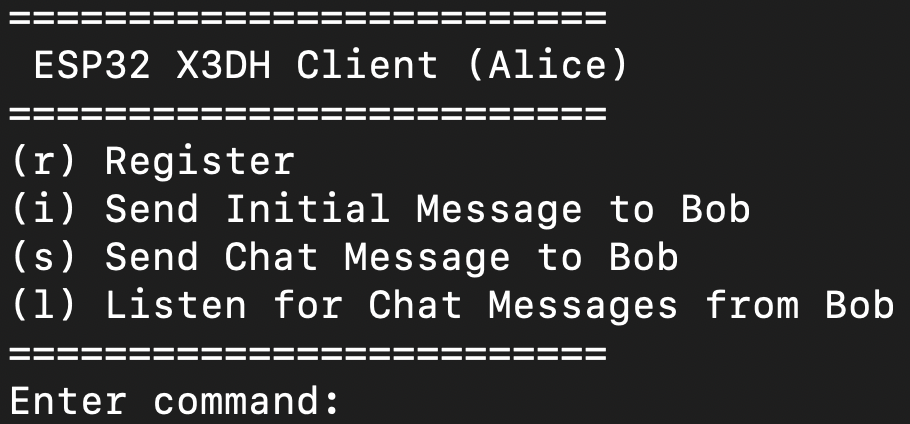
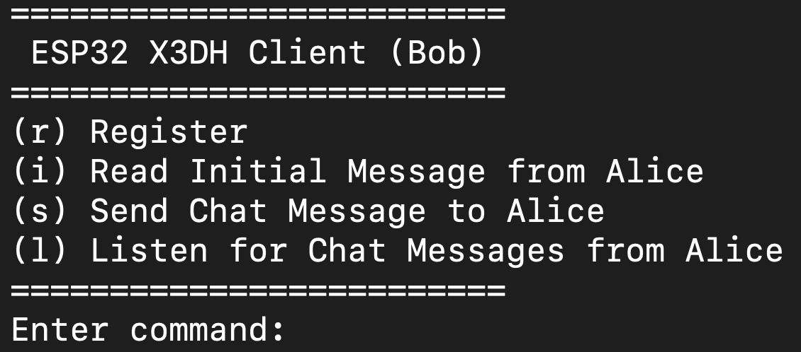

# X3DH implementation for ESP32
A C implementation of the X3DH Key Agreement Protocol for esp32 (as a client), with a containerized server.

## Specifications
`Host`'s specifications:
- OS: macOS 26.1
- Architecture: arm64
- CPU : Apple M2 (8 core)
- RAM : 8 GB
- Python: 3.12.10 (at least 3.9)
- clang: 17.0.0
- cmake: 4.1.2 (at least 3.16)
- ninja: 1.13.1
- ccache: 4.12.1
- git: 2.51.2
- dfu-util: 0.11
- Command Line Tools for Xcode: 26.1
- Docker Desktop: 4.51.0
  - Docker version: 28.5.2
  - Docker compose: 2.40.3

`Containers`'s specifications:
- OS: GNU/Linux Debian 13.1
- Python: 3.12.12
- Flask: 3.1.2
- SQLite: 3.46.1
- sqlite-browser: 3.13.1

`ESP32`'s specifications:
- MCU module: ESP32-WROOM-32E
- Chip: ESP32-D0WD-V3 (revision v3.0)
- ESP-IDF: 5.5.1 (at least 5.1)
- gcc: 14.2.0
- cjson: 1.7.19
- libsodium: 1.0.20
- libxeddsa: 2.0.1
- MbedTLS: 3.6.4

If you are using macOS, make sure to update the Python certificates. To make it easier, I strongly suggest to download Python from the official website, instead of using HomeBrew/MacPorts, and then run the following commands in your terminal:

```bash
cd /Applications/Python\ 3.x/
./Install\ Certificates.command
```

<br>

If you are using macOS and you cannot see the ESP32 serial port after connecting it via USB, you might need to install the appropriate drivers. You could try to install the [WCH34 driver](https://www.wch-ic.com/downloads/CH34XSER_MAC_ZIP.html) and follow the installation guide from the official [repository](https://github.com/WCHSoftGroup/ch34xser_macos), or you could try to install the [Silicon Labs CP210x driver](https://www.silabs.com/developers/usb-to-uart-bridge-vcp-drivers).

## How to build it

```bash
git clone https://github.com/mastronardo/esp32_X3DH.git
cd esp32_X3DH
chmod +x sart_service.sh stop_service.sh down_service.sh
```

### Server
Do not use `sudo` for the following commands if your user has permissions to run Docker commands.

```bash
# Pull the base images
sudo docker pull debian:trixie-slim
sudo docker pull linuxserver/sqlitebrowser:3.13.1

cd esp32_X3DH/server
sudo docker build -t flask-server:latest .
```

```bash
# Build all the containers and start the service.
# Wait until the server is fully started.
./sart_service.sh
```

```bash
# To stop the service
./stop_service.sh
```

```bash
# To stop and delete containers, networks and volumes
./down_service.sh
```

### Client
The first step is to set up the ESP-IDF environment. You can follow the official guide [here](https://docs.espressif.com/projects/esp-idf/en/latest/esp32/get-started/index.html). After that, navigate to the esp project directory (`x3dh_client`) and set the target to your MCU module (in this case `esp32`):

```bash
cd esp32_X3DH/x3dh_client
get_idf
idf.py set-target esp32
```

Now we can add the components that present in the ESP Component Registry. We can simply run the following commands to add the required dependencies for this project:

```bash
pip install -U idf-component-manager # be sure to keep the component Manager updated
idf.py add-dependency "libsodium"
idf.py add-dependency "cjson"
```

The tough part was to built the `libxeddsa` library for ESP-IDF, since it is not available in the Component Registry. The first step was to clone the repository inside the `components` folder of the client.

```bash
mkdir -p x3dh_client/components && cd x3dh_client/components
git clone https://github.com/Syndace/libxeddsa.git
```

After that, you need to modify the `CMakeLists.txt`, `ref10/CMakeLists.txt`, `ref10/include/cross_platform.h` file inside the `libxeddsa` folder to make it compatible with ESP-IDF. In addition, I deleted some files that were not needed for this project (for example the tests) to free some space in the flash memory.

<br>

Instead of opening every time the `menuconfig` to set the right parameters for this project, I created a `sdkconfig.defaults` file that will be automatically generate the `sdkconfig` file when you open the `menuconfig`.
The parameters mentioned above are as follows:

- `(Top)` ---> `Partition Table` ---> `Partition Table` ---> `Two large size OTA partitions`
- `(Top)` ---> `Serial Flasher Config` ---> `Flash size` ---> `4MB`
- `(Top)` ---> `Component config` ---> `Main task stack size` ---> `8192`
- `(Top)` ---> `Component config` ---> `mbedTLS` ---> `HKDF algorithm (RFC 5869)`

The first three parameters are necessary to make sure that the client binary executable file will fit inside the flash memory of the ESP32, and to avoid the buffer overflow issue when running the project.
The last one is needed to enable the HKDF algorithm required by the X3DH Key Agreement Protocol.

<br>

With `Kconfig.projbuild` we generate a new section inside the `menuconfig` called `Select X3DH Actor`, where the user can choose which X3DH Actor to compile the client for: `Run as Alice`, `Run as Bob`.

<br>

Since that we are going to store the keys in the NVS memory of the ESP32, it is recommended to erase the flash:
1. before flashing the client for the first time,
2. whenever you change the X3DH Actor,
3. or if you want to execute the project from a clean state.

```bash
idf.py -p PORT erase-flash
```

## How to use it
1. Start the containers:

```bash
./sart_service.sh
```

To visit the `SQLite Browser`, open your web browser and go to `http://localhost:3000`.

2. Flash the client choosing the correct X3DH Actor from the `menuconfig` (`(Top)` ---> `Select X3DH Actor`):
```bash
cd x3dh_client
get_idf
idf.py menuconfig
idf.py -p PORT build flash monitor
```

3. The client will firstly connect to WiFi, and after that the `app_main.c` will print the menu with the available options to perform the X3DH Key Agreement Protocol as `Alice` or `Bob`.


